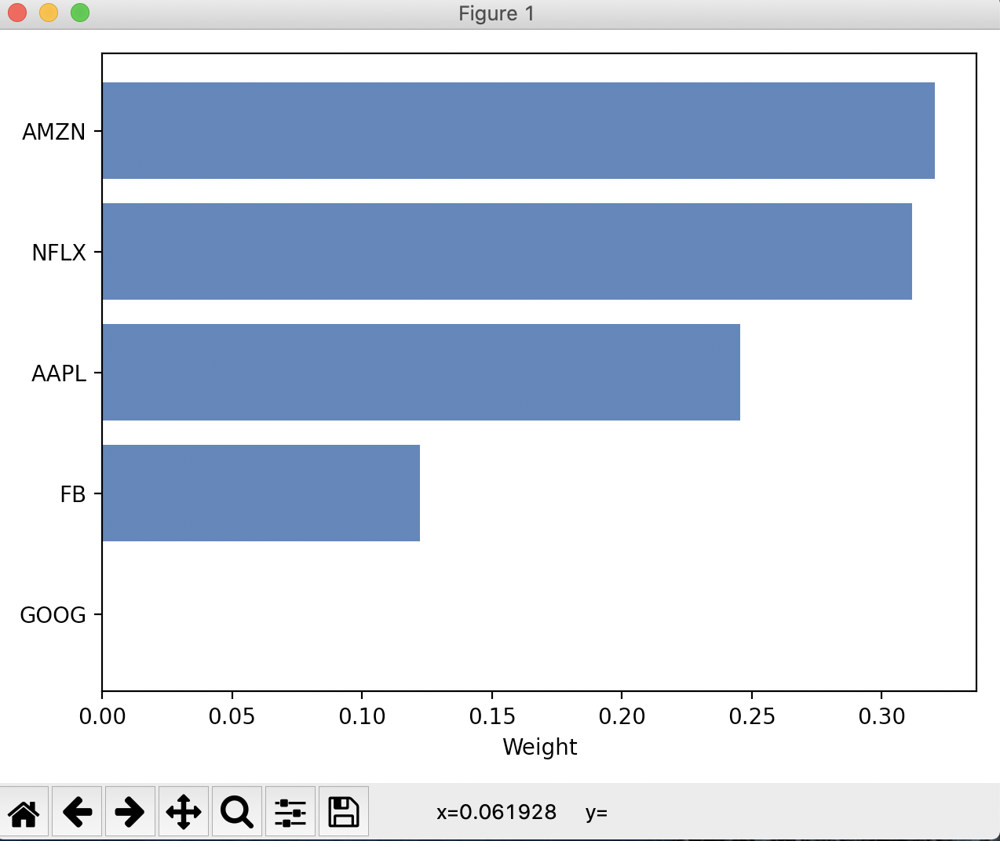

 
 <h2 align="center"> Portfolio Optimizer</h2>

A collections of various computational methods to analyze and optimize a user's investment portfolio using Modern Portfolio Theory and optimizing various factors such as Returns, Sharpe Ratio and Risk.

  Efficient Frontier Plot

 

 

  Plot for the asset weights :

 

 

 

 
