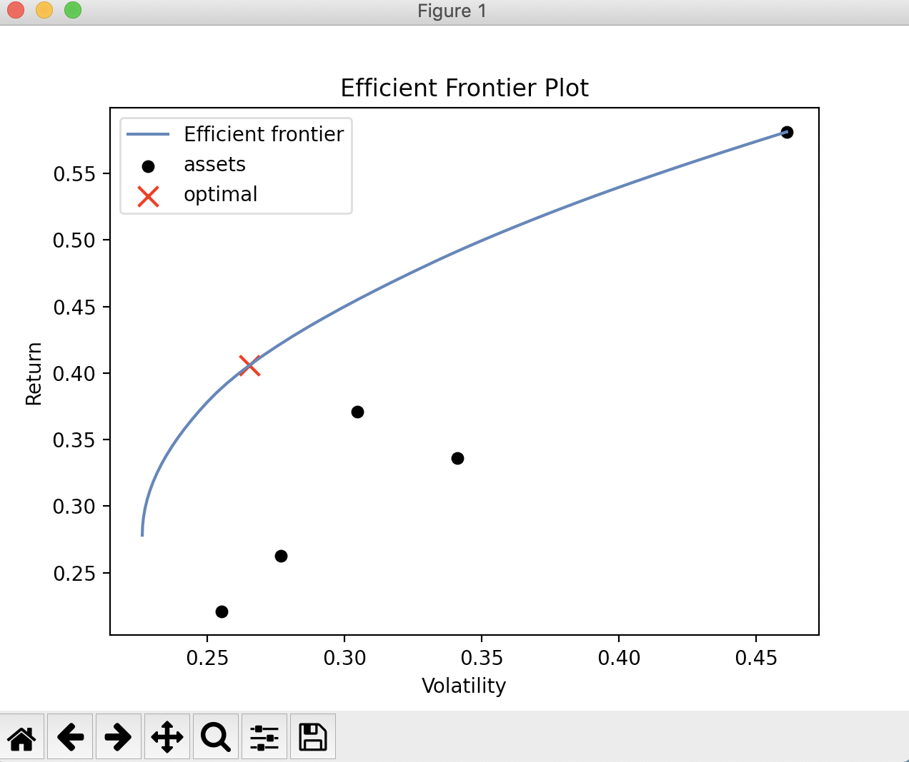

 
 <h2 align="center"> Portfolio Optimizer</h2>

A collections of various computational methods to analyze and optimize a user's investment portfolio using Modern Portfolio Theory and optimizing various factors such as Returns, Sharpe Ratio and Risk.

Also included many plots to help visualize the portfolio including the Efficient Frontier Plot :
 

 
 
 

It also includes plots for the weights of the assets of the portfolio :
 

 
